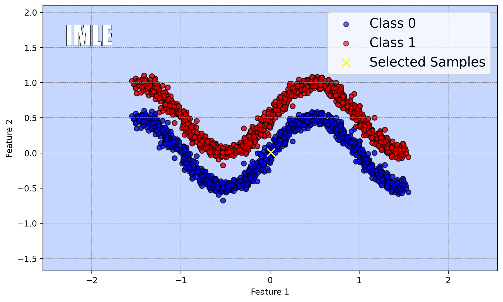

## Dependency-aware Maximum Likelihood Estimation for Active Learning

<table align="center">
  <tr>
    <td align="center">
      <br>
      <small>Active learning with DMLE for <br>model parameter updates, <br>selecting 150 samples</small>
    </td>
    <td align="center">
      <br>
      <small>Active learning with IMLE for <br>model parameter updates, <br>selecting 150 samples</small>
    </td>
    <td align="center">
      <br>
      <small>Passive learning<br>using all 700 samples<br>&nbsp;</small>
    </td>
  </tr>
</table>

This repository contains the code and resources for the **DMLE (Dependency-aware Maximum Likelihood Estimation)** approach, as introduced in our recent paper. DMLE addresses mismatches in the **sample independence assumption** in active learning by explicitly modeling **natural dependencies between samples** during model parameter estimation, while remaining fully compatible with standard active learning workflows.

---

### Overview

Traditional active learning methods typically assume that samples are independent when estimating model parameters. This assumption is often violated in practice, especially under **cyclic or sequential active learning**, which can lead to inaccurate parameter estimates.  

DMLE introduces a principled approach to:

- Account for **natural dependencies between samples** during likelihood estimation.
- Maintain compatibility with any active learning strategy (uncertainty-based, diversity-based, etc.).

DMLE focuses solely on improving **parameter estimation**; it does not modify the sample selection strategy, making it modular and easy to integrate with existing pipelines.

---

### Features

- Explicitly models sample dependencies in active learning.
- Compatible with a wide range of active learning strategies.
- Lightweight and easy to integrate with workflows.
- Works on both **synthetic** and **real-world datasets**, supporting multiple data modalities.

---

### Repository Structure
```
DMLEforAL/
│
├── b_py_combined.bash          # Combined Bash script for preprocessing or setup
├── execute_combined_cpu.bash   # Script to execute experiments on CPU
├── data.py                     # Dataset loading and preprocessing
├── main.py                     # Main script to run experiments
├── model.py                    # Model definitions
├── plot_results_submission.py  # Script to plot the results
├── print_results_submission.py # Script to print the results
├── utils.py                    # Utility functions (metrics, helper routines)
├── README.md                   # This file
└── requirements.txt            # Python dependencies
```

### Installation

Clone this repository:

```bash
git clone https://github.com/yourusername/dmle.git
cd dmle
pip install -r requirements.txt
```

### Running Experiments & Datasets

**`main.py`**: Run this script to reproduce the results presented in the paper.  
**`plot_results_submission.py`**: Generate accuracy plots from experiment results.  
**`print_results_submission.py`**: Print the accuracy values at a specific active learning cycle.  

You can run experiments directly with:

```bash
python main.py $init_size $num_queries $num_cycles $temperature $seed $selection $strategy $dataset $obj
```
where the arguments are:
* `init_size`: Initial labeled set size.
* `num_queries`: Number of samples queried per cycle.
* `num_cycles`: Number of active learning cycles.
* `temperature`: Temperature parameter for sampling.
* `seed`: Random seed for reproducibility.
* `selection`: Sampling method.
* `strategy`: Active learning strategy (e.g., entropy, least confident, margin, BALD, coreset, etc.).
* `dataset`: Dataset name (e.g., SVHN, EMNIST, Tiny-Imagenet).
* `obj`: Objective function to optimize (e.g., DMLE, IMLE, etc.).

#### Datasets

- **SVHN**: Download the data matrix and place it in the same folder: [SVHN data](http://ufldl.stanford.edu/housenumbers/).  

- **EMNIST**: Preprocessing takes time initially. Use the `load_data` function the first time to create numpy files. For subsequent runs, load the prepared data from these numpy files. The saving/loading code is commented accordingly during each step.  

- **Tiny-Imagenet**: Download the data and place it in the same folder: [Tiny-Imagenet data](https://www.kaggle.com/datasets/nikhilshingadiya/tinyimagenet200). Preprocessing takes time initially. Use the `load_data` function the first time to create numpy files. For subsequent runs, load the prepared data from these numpy files. The saving/loading code is commented accordingly during each step.
  
- **Other datasets**: Automatically downloaded via Keras/TensorFlow dataset repositories; no additional downloads are needed.

#### Customization

- To change **datasets**, modify `data.py`.  
- To change the **model architecture**, modify `model.py`.  
- To apply the **DMLE parameter estimation fix**, use the functions provided in `utils.py`.  

### Experiments

DMLE has been evaluated on:

- Synthetic datasets to demonstrate the impact of sample dependencies in cyclic active learning.

- Real-world classification tasks showing improved model performance with fewer labeled samples.

- Comparison with the traditional maximum likelihood estimation (IMLE) and the statistical bias mitigation approach proposed by Farquhar et al. (2021).

Results demonstrate that DMLE enhances parameter estimation and accelerates learning in active learning settings where sample selection introduces dependencies among data points.

### Citation

If you use this code in your research, please cite our paper:

```
@article{DMLEforAL2025,
  title={Dependency-aware Maximum Likelihood Estimation for Active Learning},
  author={Beyza Kalkanli, Tales Imbiriba, Stratis Ioannidis, Deniz Erdogmus, Jennifer Dy},
  journal={TMLR},
  year={2025}
}
```
